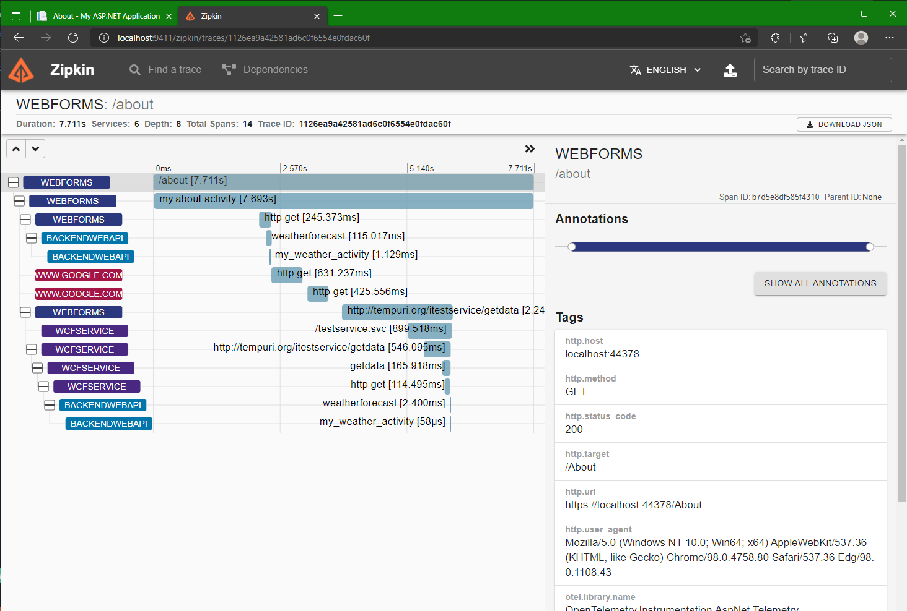
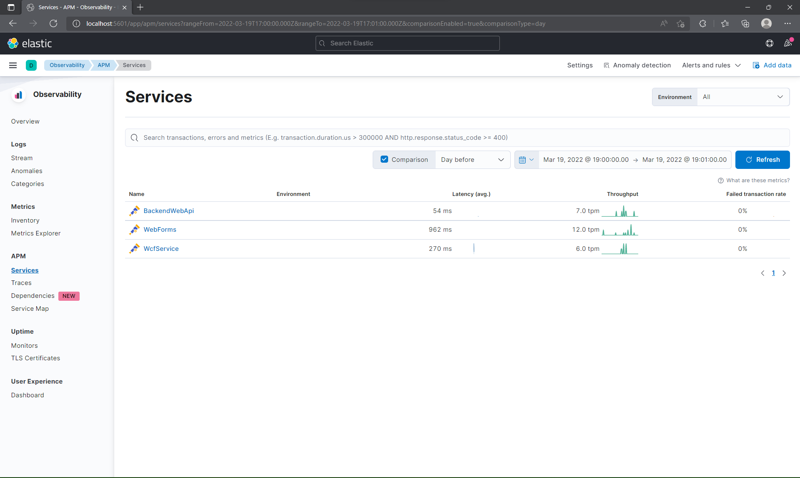
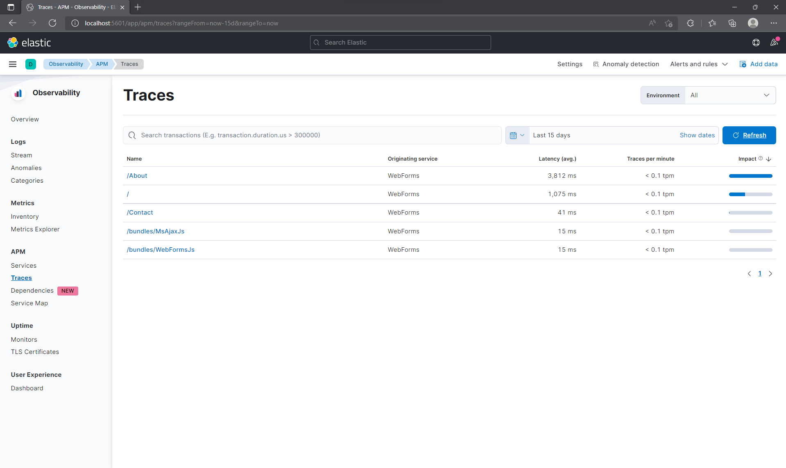
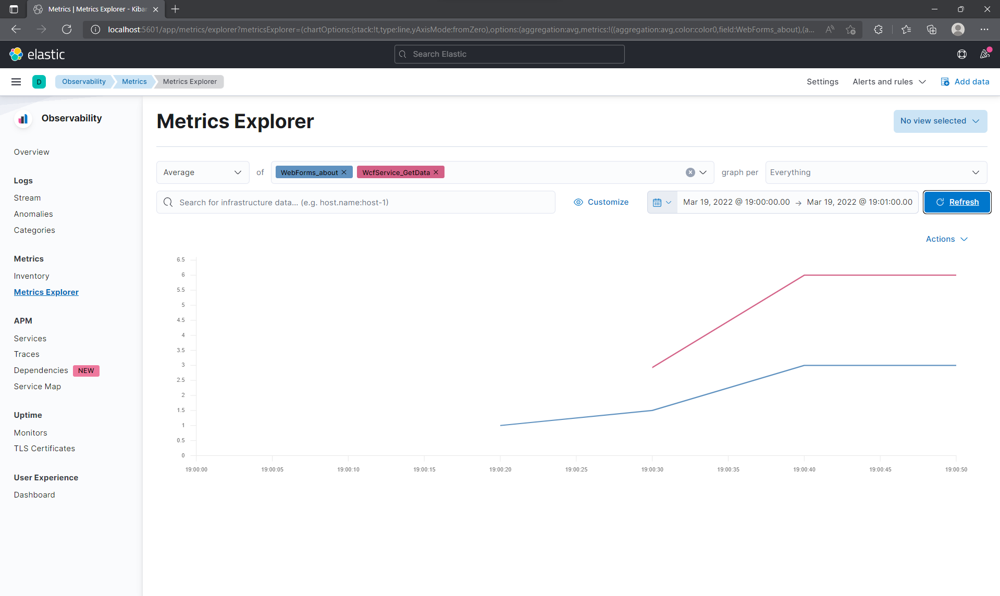
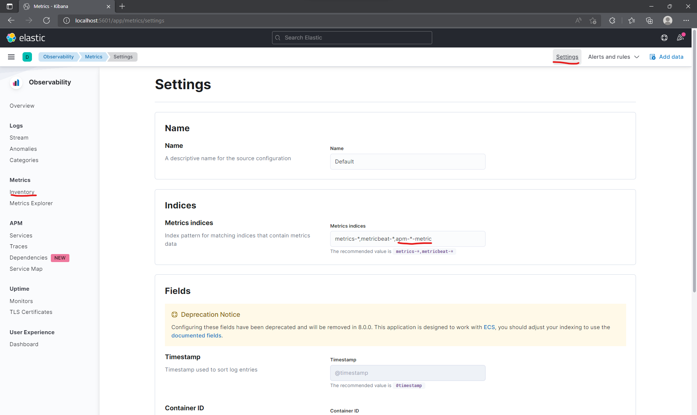

# open-telemetry-tests
Various tests of OpenTelementry .NET framework

You need to have a Docker installed

Start a open telemetry collector within ./src/otel-collector with `docker compose up`.

*Or*

Start a open telemetry collector within ./src/elastic with `docker compose up`.

Then you can run different projects from solution, bear in mind that some projects depend on others.

Sources:
[opentelemetry-dotnet](https://github.com/open-telemetry/opentelemetry-dotnet/)
[opentelemetry-collector-contrib](https://github.com/open-telemetry/opentelemetry-collector-contrib/)

**Prometeus, Zipkin**

**Elastic APM**

*Services*

*Traces*

*Metrics*

*Settings*
